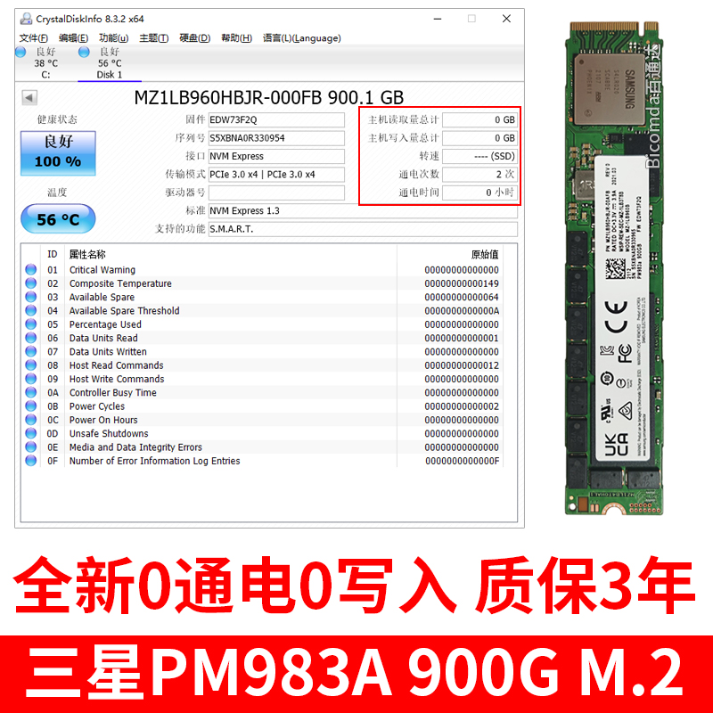
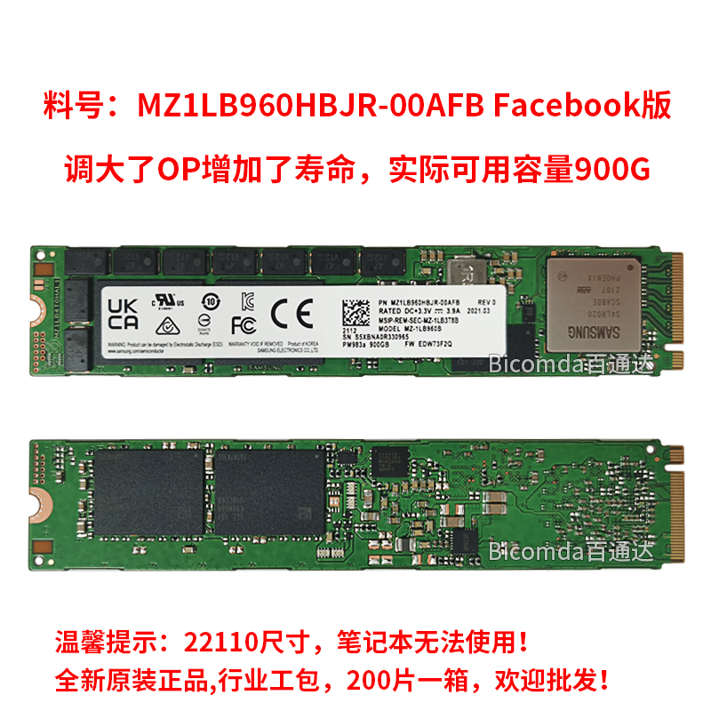
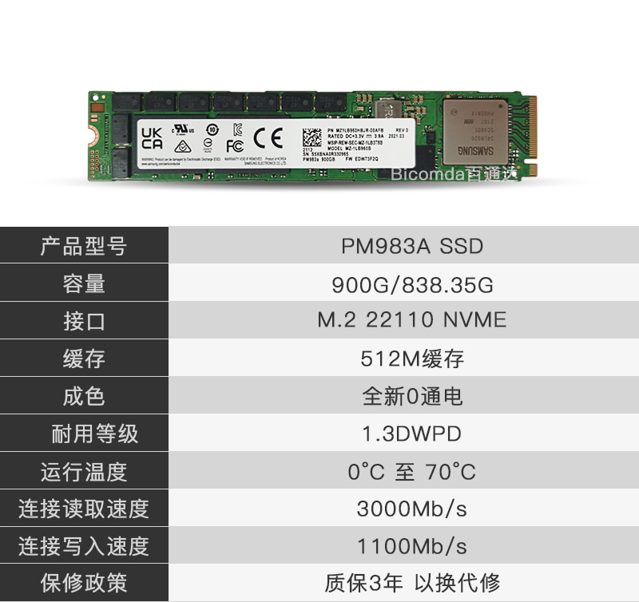

## 开场
在淘宝以368RMB的价格购买了一根店保3年、0通电、0写入的三星PM983a 900G版本。

我一直以来对三星这家硬盘厂商的印象一直都不是很好，不仅来源于三星昂贵的价格，还因为三星的售后政策完全不管海淘等一系列来源的货，造成要么你就高价买国行，要么你就没保修，甚至三星硬盘的主控没有任何流出的工具，真的出了问题你都没有办法自己去维修。

## 基本信息
    

- m.2 22110规格

这个规格基本上就和绝大多数的笔记本说再见了，一般的消费级主板，不管是MATX还是ATX版型的主板基本上也就只有一个m.2槽会配22110的长度，铭瑄的ATX板子，比如说[MS-iCraft Z690 WIFI](http://www.maxsun.com.cn/2021/1103/5619.html)配的m.2 22110规格的接口达到了3个，远超其他友商，以后等12代英特尔cpu白菜价了可以考虑买一块来玩玩。

- 双面各2颗粒共1TB TLC闪存颗粒 512MB缓存

其实这里奇怪的地方就出来了，一般来说颗粒容量和缓存容量应该是1:10的关系，即颗粒容量1TB的ssd配容量1GB的缓存，实际这个神奇的缩水和定制固件的操作就为后面的一些问题埋下了伏笔。

- Facebook数据中心版，量产时调大了OP(预留空间)

据我所知PM983A这个盘有1.88TB(AWS数据中心定制)和900GB(Facebook数据中心定制)这两个版本，900GB这个盘在实际电脑中显示的容量是838GB，而一般的1TB硬盘在实际电脑中显示的容量是932GB，两者实际容量差距也在100GB左右。

- 三星凤凰ARM主控

对这个主控其他都不用说，最大的问题就三个字，**大火炉**，实际情况在不安装散热器的情况下这颗主控能刚插上电脑开机空载的状态就能飙到75度，短期读写破100度轻轻松松，卖家在包装内附赠了一根22110的薄散热片、两根黑色皮筋、一片蓝色导热硅脂垫，但实际情况下这些东西基本上就没什么用，你得自己用厚大的散热片来散热，比如说微星的冰霜铠甲内自带的厚度为2mm的硅脂垫，才能大概把空载温度压在了60度左右。

- 读取3000MB/S 写入1100MB/S

和绝大多数的企业级m.2 ssd相同，采用的是直写颗粒，而不是写入模拟slc的方式，直写tlc能达到这个速度，也算是比一众消费级要强了。

- 耐用等级 1.3DWPD

[DWPD](https://www.kingston.com/en/ssd/dwpd)，三年的质保期，换算过来1249.56TBW，总计1388.4PE，也算是超过TCL颗粒的1000PE的理论写入循环次数了。

## 问题

- 发热非常严重，特别是主控，这个原因在前面也说过了，电流大功耗高，加上主控没有任何的节能措施，导致发热量非常的大，怕是用几年会出现主控虚焊等问题啊。

- 硬盘SMART的 0F错误日志数不停的涨，每次开关机上涨2以上，半个月不到0F数值已经从0上涨到了437，虽然这个东西不会对硬盘本身带来什么影响，每次都来一点还是挺烦人的。

- 这个磁盘的默认扇区大小为4KB，并且不支持模拟成512B，[详情](https://kb.vmware.com/s/article/2091600?lang=zh_cn)，这个一般来说对现代的操作系统没有任何的影响，但是对部分老旧的bios，这个问题就大了，很容易出现bios无法启动操作系统、进入不了刷写主板固件模式的问题，这个问题我就在微星的主板上遇见了，一旦插上这根硬盘，在微星的m-flash刷bios模式，读取存储器的时候就会出现假死的情况，询问了微星的官方支持和官方论坛，也只是让我做一些无用的操作，确认这确认那的，解决不了实际问题。可能想玩大船，微星似乎并不怎么适合吧。

## 总结

第一次购买所谓的大船货，体验了一段时间，优点和缺点都很明显。

优点有两点
- 便宜，将近1TB的版本只需要一般消费级产品512G的价格就能买到。
- 存储芯片的耐久度好，不管是PE次数还是耐温都要强于消费级。

缺点也是两点
- 折腾，家用平台上企业级的产品，可能会出现各种各样的问题，软件硬件上都会存在不兼容的情况。
- 没有售后，对于手工好的人来说，大船ssd即使坏了也能拆芯片来维修或者做成新的ssd，但对于我这种没有经验的人来说，基本上就是坏了就只能换了。

总之对于这一次购买，我的体验还是很不错的，捡便宜的乐趣比想象中要大得多，就是我主板上就只有一个m.2口是22110的长度，而且我也不太想去买转接卡，这ssd的高温难以在转接卡上解决，以后有机会倒是可以找找看有没有sata的大船货。